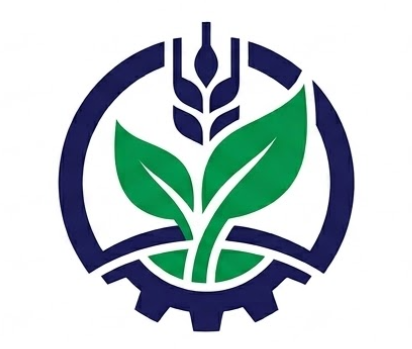

<div align="center">

  

  # 🌾 Chaudhary Traders — Official Sungro Crop Care Store & POS System

  **Exclusive Authorized Dealer of Sungro Crop Care (PVT) Ltd — Sahiwal, Pakistan**

  [](https://react.dev/)
  [](https://vitejs.dev/)
  [](https://tailwindcss.com/)
  [](LICENSE)

  *Providing 100% original fertilizers, crop protection sprays, hybrid seeds, micronutrients, and expert agronomy advisory to the farming community of Sahiwal since 2009.*

</div>

---

## 📌 Executive Summary

**Chaudhary Traders**, located at Adda Sang Noor Shah, Sahiwal, is the leading exclusive franchise dealership for **Sungro Crop Care**. This modern web application serves a dual purpose:
1. **Public Farmer Portal**: Provides farmers with high-yield crop advice, genuine product catalogs, live weather-based spray condition recommendations, and direct WhatsApp agronomy consultation.
2. **In-Store POS & Admin Counter**: A complete Point-of-Sale billing counter with automated invoice generation, live stock inventory control, daily sales statistics, and instant thermal receipt printing for daily store transactions.

---

## ✨ Key Features

### 🛍️ Public Agriculture Portal
- **Dynamic Hero Banner**: Staggered text animations and high-resolution slides displaying Sungro crop care solutions.
- **Product Catalog & Filtering**: Search & filter by categories:
  - 🧪 *Fertilizers* (DAP, Urea, CAN Calcium)
  - 🛡️ *Crop Sprays & Pesticides* (Coragen, Karate, Fungicides, Weedicides)
  - 🌾 *Hybrid Seeds* (Corn, Wheat, Vegetables)
  - 🌿 *Micronutrients & Foliar Sprays* (Zinc, Boron, Bio-stimulants)
- **Agri Weather & Spray Advisory**: Live weather conditions widget analyzing humidity, wind speed, and temperature to give farmers real-time spray window recommendations.
- **Store Location & Contact**: Embedded interactive map for Adda Sang Noor Shah, Sahiwal, plus direct WhatsApp quick consultation.

### 💼 In-Store POS & Inventory Management
- **Point of Sale (POS) Counter**: Quick item selection, automatic total calculation, discount handling, and customer receipt recording.
- **Thermal Receipt Generator**: Instant printable invoice layout customized with official brand header, itemized breakdown, and store helpline contact details.
- **Real-Time Inventory Control**: Track stock quantities, low-stock status alerts, and easy price adjustments.
- **Sales Analytics Dashboard**: Daily sales metrics, top revenue products breakdown, and order volume counters.

---

## 🛠️ Technology Stack

| Layer | Technology |
| :--- | :--- |
| **Frontend Framework** | [React 19](https://react.dev/) + [Vite 6](https://vitejs.dev/) |
| **Routing** | [React Router DOM v7](https://reactrouter.com/) |
| **Styling & UI** | [Tailwind CSS v4](https://tailwindcss.com/) + Custom HSL Color Tokens |
| **Icons** | [Lucide React](https://lucide.dev/) |
| **Data Analytics** | [Recharts](https://recharts.org/) |
| **Build & Tooling** | Vite, PostCSS, ESLint |

---

## 🚀 Getting Started

### Prerequisites
Make sure you have [Node.js](https://nodejs.org/) (v18 or higher) installed on your system.

### Installation

1. **Clone the repository**:
   ```bash
   git clone https://github.com/Abdullah-Tahir-SE/Chaudhary-Traders-.git
   cd Chaudhary-Traders-
   ```

2. **Install dependencies**:
   ```bash
   npm install
   ```

3. **Start the local development server**:
   ```bash
   npm run dev
   ```
   Open your browser and navigate to `http://localhost:5173`.

4. **Build for production**:
   ```bash
   npm run build
   ```

---

## 📂 Project Structure

```
Chaudhary-Traders/
├── public/
│   ├── logo.png          # Official Chaudhary Traders Emblem
│   ├── favicon.png       # Web Browser Favicon Icon
│   └── robots.txt
├── src/
│   ├── assets/           # High quality crop & store images
│   ├── components/
│   │   ├── admin/        # POS Counter, Admin Sidebar, Sales Stats, Stock Management
│   │   ├── public/       # Navbar, Footer, Hero Carousel, Services, Categories, TopBar
│   │   ├── ui/           # Reusable UI primitives (Buttons, Cards, Dialogs, Tables)
│   │   └── weather/      # Weather Bar & Spray Advisory Widget
│   ├── hooks/            # Custom React hooks (useMobile, etc.)
│   ├── lib/              # Utility functions
│   ├── pages/
│   │   ├── admin/        # Dashboard, POS Page, Inventory Page
│   │   └── public/       # Home, Products, AboutUs, Contact
│   ├── services/         # Weather & API service helpers
│   ├── App.jsx           # App routing setup
│   ├── main.jsx          # App entry point
│   └── styles.css        # Tailwind CSS v4 & custom keyframe animations
├── index.html            # Main HTML template with SEO tags & icons
├── package.json
└── vite.config.js
```

---

## 📍 Store Information

- **Store Name**: Chaudhary Traders (Exclusive Dealer — Sungro Crop Care)
- **Address**: Adda Sang Noor Shah, Tehsil & District Sahiwal, Punjab, Pakistan
- **Helpline / WhatsApp**: +92 341 4518001
- **Operating Hours**: Monday – Saturday: 08:00 AM – 08:00 PM

---

<div align="center">
  <sub>Developed & Maintained for Chaudhary Traders Sahiwal © 2026. All rights reserved.</sub>
</div>
